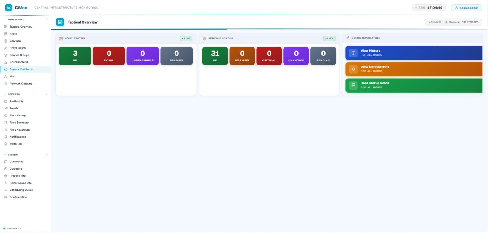
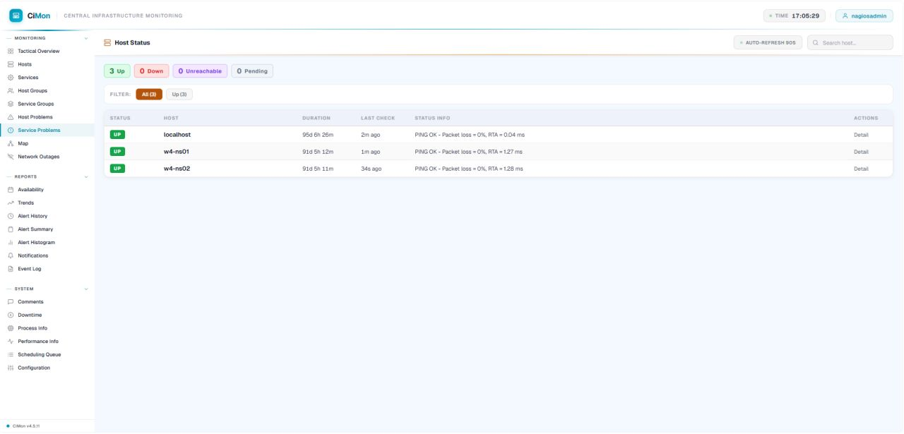

<div align="center">

# CiMon

### Modern Web UI Theme for Nagios

A modern, lightweight, and responsive user interface for Nagios that improves usability, visibility, and monitoring efficiency.


</div>

---

## Overview

**CiMon** is a modern and feature-rich web UI theme designed for Nagios. It enhances the default Nagios interface with real-time dashboards, improved service visibility, advanced filtering, and a cleaner user experience.

Whether you are monitoring a small infrastructure or a large enterprise environment, CiMon provides a more intuitive and efficient way to visualize monitoring data.

---

## ✨ Features

| Category | Capabilities |
|-----------|-------------|
| 🏠 **Dashboard** | Modern dashboard with global search and quick visibility of all problematic hosts and services |
| ⚙️ **Host Management** | Compact and organized host details view |
| 🛡️ **Service Monitoring** | Collapsible service details for improved navigation |
| 🔔 **Notifications** | Clean and simplified notification interface |
| 🎨 **User Interface** | Responsive design with lightweight JavaScript and CSS (no frontend framework required) |

---

## 🖥️ Screenshots

### Dashboard

> Add dashboard screenshot here

```text


```

### Host Details

> Add host details screenshot here

```text

```

### Service View

> Add service view screenshot here

```text

```

### Notifications

> Add notification screenshot here

```text
screenshots/notifications.jpg
```

---

## 🚀 Installation

### Download CiMon

Download the latest CiMon package and upload it to your Nagios server.
Extract the package and replace the existing Nagios web theme.

```bash
git clone https://github.com/zakirpcs/CiMon.git
unzip CiMon-main.zip -d /usr/local/nagios/
cd /usr/local/nagios/

# Backup existing theme
mv share share.old

# Deploy CiMon theme
mv CiMon-main share
```

---

## 🔄 Restart Services

Restart Nagios and the web server to apply the new theme.

```bash
systemctl restart nagios httpd
```

---

## 📋 Requirements

- Nagios Core
- Apache HTTP Server (httpd)
- Linux Server (RHEL, AlmaLinux, Rocky Linux, CentOS, Debian, Ubuntu)
- Modern Web Browser

---

## 📦 Package Structure

```text
CiMon-main/
├── css/
├── js/
├── images/
├── includes/
├── templates/
└── index.php
```

---

## 💼 Licensing

CiMon is a open source software product.

---

<div align="center">

**CiMon — Bringing a Modern Monitoring Experience to Nagios**

</div>
